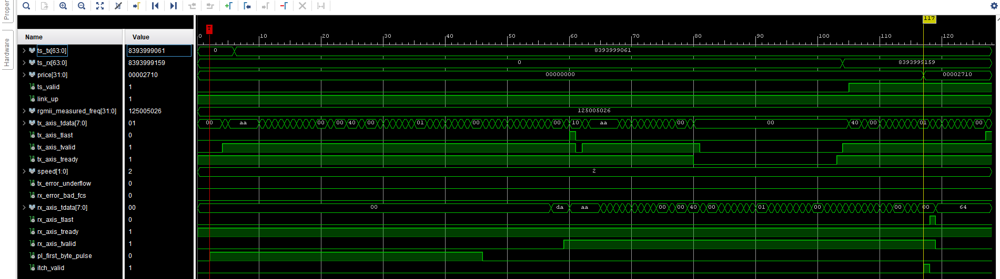

##  Project Overview - FPGA Feed Handler
This is an FPGA-based market data feed handler. It listens to exchange feeds (like NASDAQ ITCH), inserts the appropriate network headers, and streams the data out with under 100 cycles of latency. The design ensures ultra-low latency and determinism for high-frequency trading and has been tested both in simulation and on FPGA evaluation hardware.

##  Project Structure

Here's a simplified view of the folder hierarchy in this repo:
```graphql
fpga-feed-handler-main/
|
|-- rtl/                  # Core RTL modules
|   |-- pl_tx_fsm_full.v  # Payload transmit FSM (generates ITCH messages)
|   |-- pl_header_inserter.v # Ethernet + IPv4 + UDP header generator
|   |-- header_skip.v     # Parser that skips headers before payload
|   |-- mdio_cfg.v        # MDIO config engine for Ethernet PHY
|   |-- eth_mac_1g_*.v    # 1G Ethernet MAC (from the open-source verilog-ethernet project)
|   |__ top.v             # Integration point
|
|-- tb/                  # Simulation testbenches
|   |-- tb_top_loopback.sv  # End-to-end loopback simulation
|   |-- tb_header_skip_parser.v # Unit test for header skip parser
|   |__ tb_mdio_cfg_transaction.sv # Test for PHY config FSM
|
|-- scripts/
|   |-- build_bitstream.sh      # Synthesis / Implementation
|   |   |__build_bitstream.tcl
|   |-- sim-build.sh      # Simulation runs
|   |-- clean.sh          # Remove build artifacts / vendor files
|   |__ generate_ltx.sh   # Generate Logic Analyser signal definitions offline
|
|-- docs/                 # (if present) notes, diagrams, wiki exports
|
|--constraints/
|   |-- board_pinout.xdc       # Pin mapping from reference board schematics
|   |-- timing_basic.xdc       # Clock + RGMII timing from datasheets
|   |-- README.md              # Mini-note explaining what's included/excluded
|
|__ README.md             # Project introduction and usage
```
##  How It Works

### 1. FSM Generates ITCH Payload:

The pl_tx_fsm_full module drives a test ITCH message payload (e.g. "Add Order" type A).

### 2. Header Insertion
pl_header_inserter prepends Ethernet + IPv4 + UDP headers, forming a valid packet for transmission.

### 3. MAC Transmission
The packet is streamed into the 1G MAC (eth_mac_1g_rgmii_fifo), which handles serialization to the PHY.

### 4. Loopback & Parsing
On receive, header_skip removes the protocol headers so that only the ITCH payload remains for parsing.

### 5. Simulation Environment
Several testbenches validate the FSMs, PHY config (mdio_cfg), and end-to-end loopback.

### 6. FPGA Evaluation Hardware
The generated bitstream was deployed on FPGA evaluation hardware. Integrated Logic Analyzer (ILA) was used for validation and latency measurement.
## Latency Performance

- End-to-end latency: 99 fabric clock cycles

- Measured as:

  - ts_rx $\rightarrow$ ts_tx (from when the header_inserter drives headers into AXI-S / MAC transmit, until the first ITCH payload byte is observed at the ITCH parser).

- Parser stage latency: 12 fabric clock cycles

  - Measured between ts_valid (timestamp captured) and itch_valid (ITCH fields available to downstream logic).



- Deterministic behavior:

  - The design introduces no jitter, as there are no CPU scheduling effects.

  - Latency is consistent across runs and packets.

- Wall-clock equivalent:

  - At 125 MHz fabric clock,

    - 99 cycles $\approx$ 792 ns (end-to-end).

    - 12 cycles $\approx$ 96 ns (parser).

- Industry context:

  - These results fall within the range typically targeted by FPGA-based feed handlers in high-frequency trading, where sub-microsecond deterministic latency is a common requirement.

## Diagram
```text
                            +------------------+
                            |  200 MHz refclk  |
                            |   (clk_200_p/n)  |
                            +---------+--------+
                                      |
                                      v
                               +--------------+
                               |  clk_wiz_0   |
                               | (PLL/MMCM)   |
                               +------+-------+
                                      |
                              fabric_clk (125 MHz)
                                      |
   rgmii_rx_clk (125 MHz)             |
          from PHY                    |
              |                       |
              v                       v
        +-----------+          +---------------------+
        | RGMII PHY | <------> | eth_mac_1g_rgmii    |
        +-----------+   RGMII  | (external open-     |
                               |      source core)   |
                               |---------------------|
                               | AXI-S RX (MAC->user)|
                               | AXI-S TX (user->MAC)|
                               +---------+-----------+
                                         |
                                         v
                           +-------------------------+
                           |      ITCH Parser        |
                           | (extract fields: price, |
                           |  qty, order_id, etc.)   |
                           +-----------+-------------+
                                       |
                                       v
                             +-------------------+
                             |     Strategy      |
                             | (e.g. threshold)  |
                             +---------+---------+
                                       |
                                       v
                             +-------------------+
                             |    Order Gen      |
                             | (formats packets) |
                             +---------+---------+
                                       |
                                       v
                               AXI-S TX back into MAC
                                       |
                                       v
                                Ethernet transmit
                                       |
                                       v
                                   Network / Exchange

```
## Dependencies

See [THIRD_PARTY.md](./THIRD_PARTY.md) for details on required external components.
